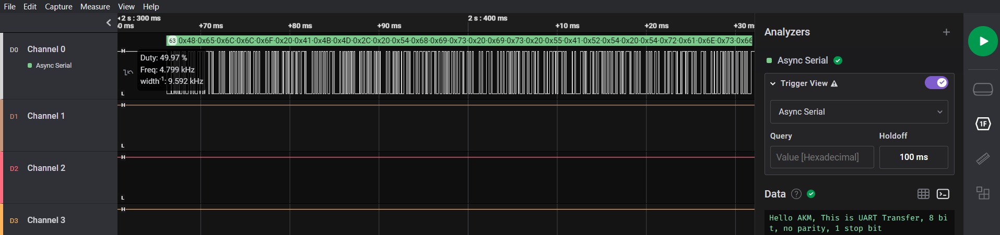
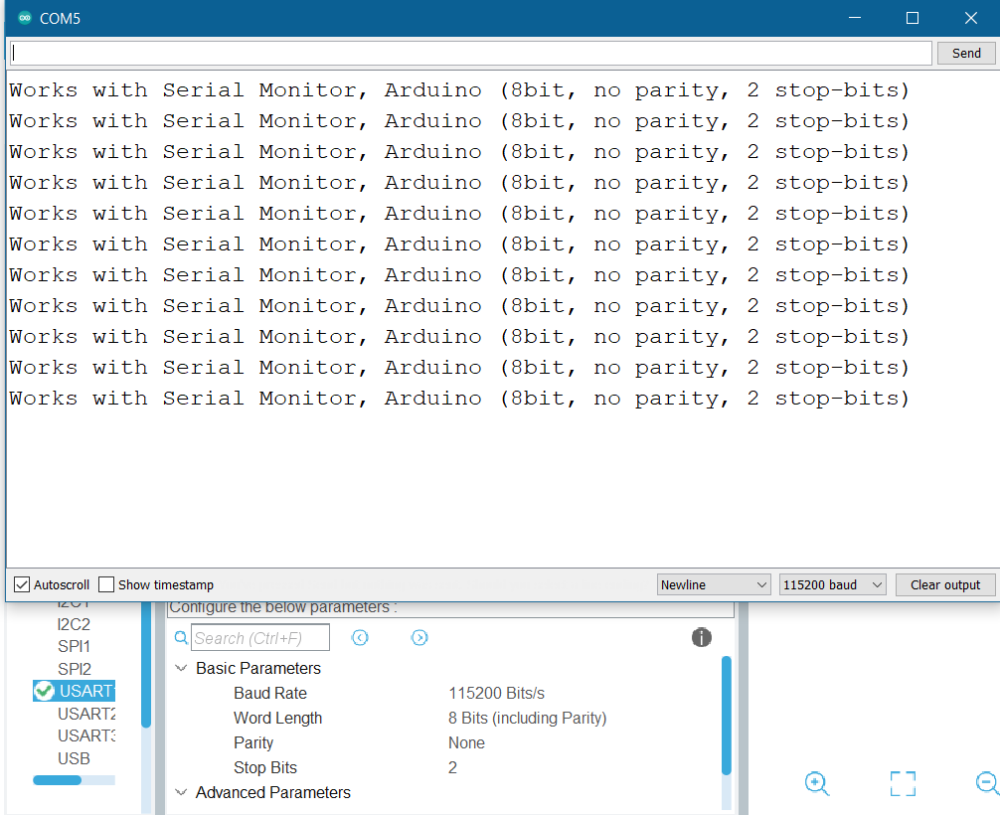

# UART on STM32F1
## Introduction
Implementing UART on STM32F103C8T6 and Examining the output on PuTTY and Arduino Serial Monitor. Also driving UART devices and peripherals with STM32.

## Contents
```
|_ uart_ftdi
|_ arduino_serial_compat
|_ hc05-bluetooth-interfacing
```

1. [UART through FTDI](./uart_ftdi/):
UART transfer through FTDI. Examining the UART bits on a Logic Analyser.



2. [UART Arduino Serial Monitor](./arduino_serial_compat/): UART configuration so that it can be used with Arduino Serial Monitor.



3. [HC05 Bluetooth Module Interfacing](./hc05-bluetooth-interfacing/): This project is under development, however it has scope of usage of DMA based UART transfer.

<hr>
# Other experiments:

Also checkout my other works with STM32F1: [STM32F103 RTOS](https://github.com/anindyamitra15/stm32-rtos), [STM32F1 GPIO Alternate Functions](https://github.com/anindyamitra15/stm32-gpio-modes) and, [STM32F1 PWM Modes](https://github.com/anindyamitra15/stm32-pwm)
